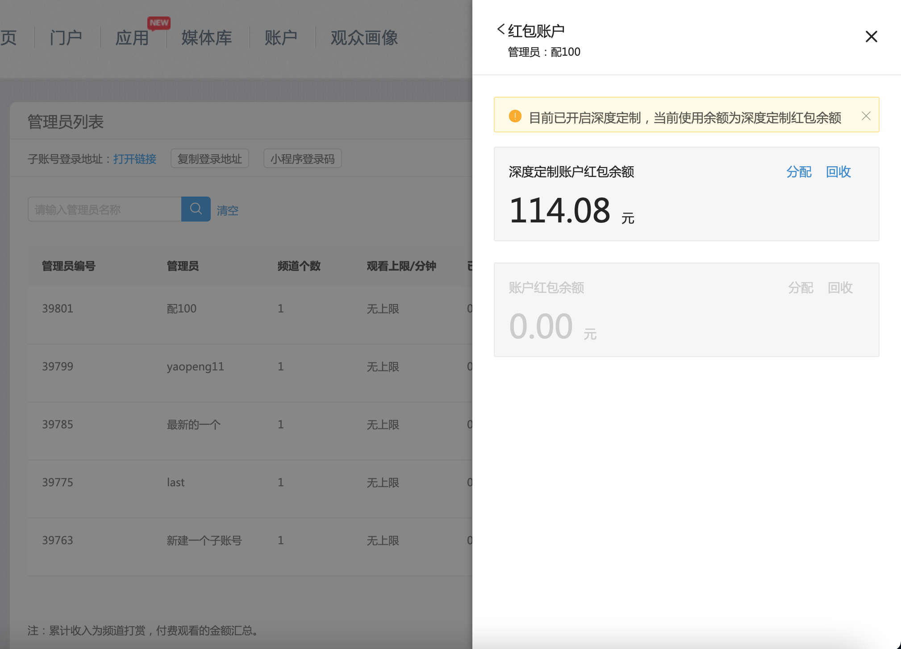
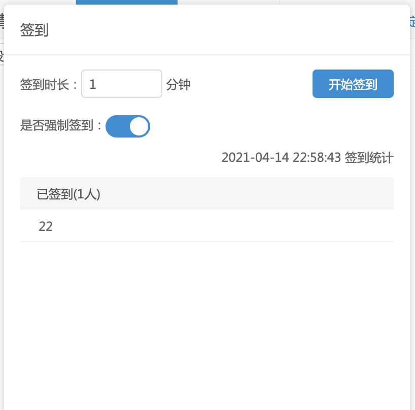
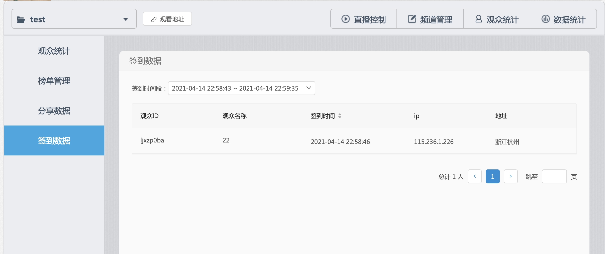

1.子账号发红包

企业版用户可对子账号进行权限配置，配置是否允许其使用红包功能，为其开启红包权限后，并分配相应红包金额，该子管理员便可使用红包功能。

1.1开启子账号红包权限

在多账号管理-管理员列表页，管理员操作栏，点击设置，便可对子管理员可使用的功能进行设置，目前先开放红包功能。

点击开关为子管理员开启红包功能后，还需点击红包账户，给子管理员分配红包余额，子管理员才可正常使用红包功能。

1.2子账号红包账户

每个子账号的红包账户都单独维护，可进行分配回收操作。

默认情况下，每个子账号会有一个账户红包余额，主管理员对该账户进行分配回收操作。分配即将红包余额从自己的账户划入子账号账户；回收即将红包余额划入自己账户。

若企业配置了深度定制，使用自己的微信商户进行收付款，则子账号红包账户也会使用深度定制账户红包余额。子账号发红包会从这个账户走账，分配回收操作不会影响主账号的红包余额账户。

主账号分配回收记录可在账户-分配/回收记录处查看，普通红包账户和深度定制红包账户分两栏展示。

1.3子账号发红包

开启子账号的红包功能，并分配红包金额后，子账号便可使用处自动红包雨外的所有红包功能，子账号的红包使用以及红包数据记录与主账号一致，此处不再赘述。

2.签到

频道新增签到功能，支持标准直播、互动直播、竖屏直播，互动直播的签到开启入口在互动直播工具内左侧栏，下以标准直播为例说明，其他类型频道操作一致，不再赘述。

2.1发起签到

在频道直播控制聊天框下方新增了签到入口，点击后在弹窗中配置签到设置，可配置签到时长、是否强制签到。

签到时长：观众签到时间窗口期

强制签到：开启则开启签到后观众无法关闭签到弹窗，除非主动签到或签到结束

点击开始签到，观众端会立即弹出签到弹窗，观众点击立即签到则签到成功，若签到时观众未登录，则先回要求观众登录，登录完成后可继续签到。

2.2签到数据

签到过程中可实时查看见到记录

签到结束后，管理员可在观众统计-签到数据中按签到时间段查看每次签到回合的签到流水。

签到流水记录字段如图所示：

